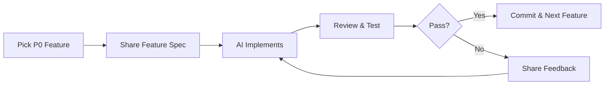

# 🔄 Recommended Development Loop

This is the agreed workflow for implementing features in PRISM:

## Steps:

1. **Pick P0 Feature** - User selects the highest priority feature to implement
2. **Share Feature Spec** - User describes what they want (can be brief or detailed)
3. **AI Implements** - I implement the feature with code changes
4. **Review & Test** - User reviews the changes and tests functionality
5. **Pass?** - Decision point:
   - ✅ **Yes** → Commit the changes and move to next feature
   - ❌ **No** → Share feedback and I iterate on the implementation

## Quick Commands:
- Start with: "Implement [feature name]" or just describe what you want
- Provide feedback: "This needs [changes]" or "Fix [issue]"
- Approve: "LGTM" or "Commit this"
