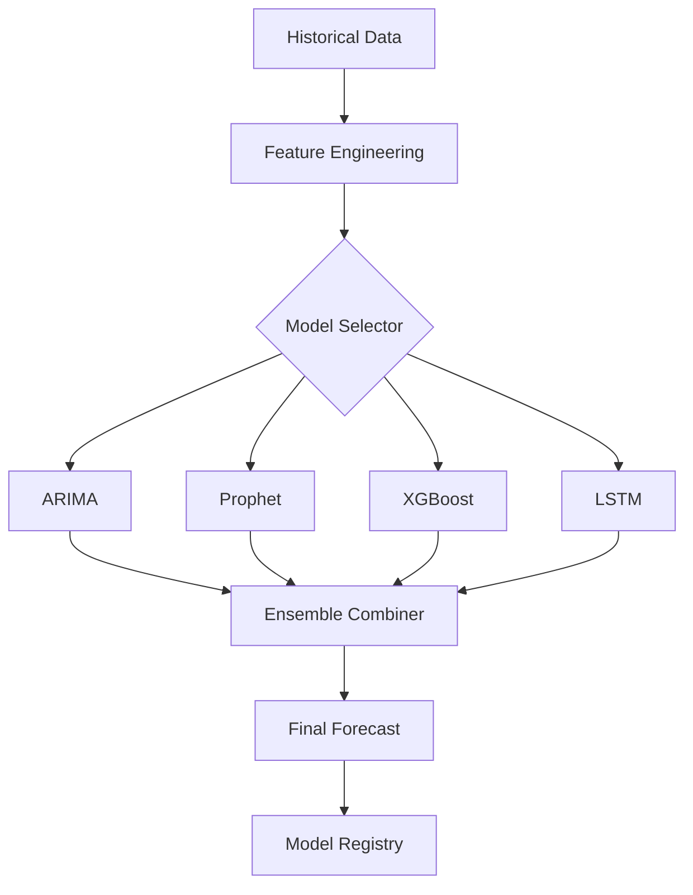

# 📈 Feature Spec: Enhanced Forecasting Models

> **Priority**: P1 (High)  
> **Estimated Effort**: 2 weeks  
> **Dependencies**: Existing ARIMA forecasting

---

## Overview

Expand forecasting beyond ARIMA with Prophet, LSTM, XGBoost, and ensemble methods. Implement model registry for versioning and A/B comparison.

---

## Models to Implement

| Model | Best For | Complexity |
|-------|----------|------------|
| **Prophet** | Trend + seasonality | Low |
| **XGBoost** | Feature-rich prediction | Medium |
| **LSTM** | Complex patterns | High |
| **Ensemble** | Combined accuracy | Medium |

---

## Architecture



---

## Model Registry

```python
# backend/services/forecasting/registry.py
class ModelRegistry:
    models = {
        "arima_v1": ARIMAForecaster,
        "prophet_v1": ProphetForecaster,
        "xgboost_v1": XGBoostForecaster,
        "lstm_v1": LSTMForecaster,
        "ensemble_v1": EnsembleForecaster,
    }
    
    @classmethod
    def get_model(cls, name: str):
        return cls.models[name]()
    
    @classmethod
    def get_default(cls):
        return cls.get_model("ensemble_v1")
```

---

## API Changes

### POST /forecasts/generate

Add `model` parameter:

```json
{
  "date": "2024-01-15",
  "region_id": "IN-MH",
  "disease": "dengue",
  "horizon": 7,
  "model": "prophet_v1"  // NEW: optional, defaults to ensemble
}
```

### GET /forecasts/models

List available models with performance metrics:

```json
{
  "models": [
    {
      "name": "arima_v1",
      "description": "ARIMA time series",
      "avg_mae": 12.5,
      "avg_mape": 0.08
    },
    {
      "name": "ensemble_v1",
      "description": "Weighted ensemble",
      "avg_mae": 9.2,
      "avg_mape": 0.05
    }
  ]
}
```

---

## Model Implementations

### Prophet
```python
from prophet import Prophet

class ProphetForecaster(BaseForecaster):
    def fit_predict(self, df, horizon):
        model = Prophet(yearly_seasonality=True)
        model.fit(df[['ds', 'y']])
        future = model.make_future_dataframe(periods=horizon)
        forecast = model.predict(future)
        return forecast[['ds', 'yhat', 'yhat_lower', 'yhat_upper']]
```

### XGBoost
```python
import xgboost as xgb

class XGBoostForecaster(BaseForecaster):
    def fit_predict(self, df, horizon):
        # Feature engineering: lag features, rolling means
        features = self._create_features(df)
        model = xgb.XGBRegressor(n_estimators=100)
        model.fit(features[:-horizon], df['y'][:-horizon])
        return model.predict(features[-horizon:])
```

### Ensemble
```python
class EnsembleForecaster(BaseForecaster):
    weights = {"arima": 0.3, "prophet": 0.4, "xgboost": 0.3}
    
    def fit_predict(self, df, horizon):
        predictions = {}
        for name, weight in self.weights.items():
            model = ModelRegistry.get_model(f"{name}_v1")
            predictions[name] = model.fit_predict(df, horizon)
        
        # Weighted average
        return sum(p * self.weights[n] for n, p in predictions.items())
```

---

## Performance Tracking

Store metrics in MongoDB:

```javascript
// model_performance
{
  "_id": ObjectId,
  "model_name": "prophet_v1",
  "region_id": "IN-MH",
  "disease": "dengue",
  "forecast_date": ISODate,
  "horizon": 7,
  "mae": 10.5,
  "mape": 0.06,
  "rmse": 12.8,
  "evaluated_at": ISODate
}
```

---

## File Structure

```
backend/
├── services/
│   └── forecasting/
│       ├── __init__.py
│       ├── base.py         # BaseForecaster ABC
│       ├── arima.py        # Existing
│       ├── prophet.py      # NEW
│       ├── xgboost.py      # NEW
│       ├── lstm.py         # NEW
│       ├── ensemble.py     # NEW
│       ├── registry.py     # Model registry
│       └── evaluation.py   # Performance metrics
```

---

## Dependencies

Add to `requirements.txt`:
```
prophet>=1.1.0
xgboost>=2.0.0
tensorflow>=2.15.0  # For LSTM
scikit-learn>=1.4.0
```

---

## Acceptance Criteria

- [ ] Prophet forecaster implemented
- [ ] XGBoost forecaster implemented
- [ ] LSTM forecaster implemented
- [ ] Ensemble combines all models
- [ ] Model registry returns correct model
- [ ] API accepts model parameter
- [ ] Performance metrics tracked
- [ ] All tests pass
