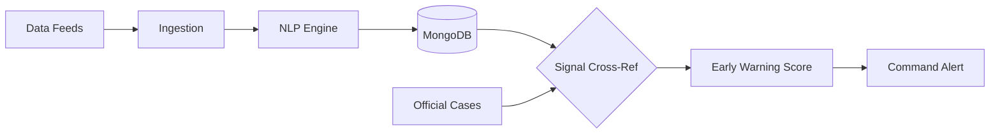

# 📰 Feature Spec: News Ingestion Pipeline

> **Priority**: P1 (High)  
> **Estimated Effort**: 1-2 weeks  
> **Dependencies**: None (standalone service)

---

## Overview

Automatically ingest health news from multiple sources to detect **Digital Smoke Signals** (early indicators) before official government case counts rise. This system mimics BlueDot's' logic by identifying "informal" signals that precede formal reports.

---

## The "BlueDot" Methodology: Asymmetric Intelligence

1.  **Informal Signal**: Local news mentions "unusual hospital overcrowding" in Mumbai.
2.  **Official Lag**: Government case counts for Dengue won't show a spike for 7 more days.
3.  **PRISM Alert**: Trigger an "Early Warning Alert" to Command Center *now*.

---

## Architecture: The Early Warning Pipeline



---

## Early Warning Score (EWS) Logic

The system calculates an **EWS** for each region:

$$
\text{EWS} = (w_1 \times \text{Mentions}) + (w_2 \times \text{Sentiment}) + (w_3 \times \text{Official Lag})
$$

-   **Mentions**: Number of unique sources reporting the same disease/location.
-   **Sentiment**: Negative sentiment score (e.g., "deadly", "outbreak", "crisis").
-   **Official Lag**: High EWS if News Trend is 📈 but Official Case Trend is ➡️ (suggests unreported event).

---

## Database Schema (Refined)

```javascript
// health_signals
{
  "_id": ObjectId,
  "disease": "dengue",
  "location": "Mumbai",
  "source_titles": ["Mumbai Mirror", "ANI"],
  "ews_score": 0.85,  // 0 to 1 scale
  "is_early_warning": true, // news trend > official trend
  "analyzed_at": ISODate
}
```

---

## NLP Processor (BlueDot Upgrade)

Use **Transformers (HuggingFace)** instead of just spaCy for deeper sentiment:

```python
from transformers import pipeline

sentiment_analyzer = pipeline("sentiment-analysis")

def analyze_signal(text: str):
    # 1. Extract Entities (Existing logic)
    entities = extract_entities(text) 
    
    # 2. Analyze Urgency/Sentiment
    sentiment = sentiment_analyzer(text[:512])[0]
    
    return {
        "entities": entities,
        "sentiment_label": sentiment['label'],
        "sentiment_score": sentiment['score']
    }
```


---

## File Structure

```
backend/
├── services/
│   ├── news/
│   │   ├── __init__.py
│   │   ├── ingestion.py    # RSS/API fetching
│   │   ├── processor.py    # NLP extraction
│   │   ├── signals.py      # Signal detection
│   │   └── sources.py      # Source configurations
├── routes/
│   └── news.py
└── schemas/
    └── news.py
```

---

## Configuration

Add to `.env`:
```
NEWS_API_KEY=your_newsapi_key
NEWS_INGEST_INTERVAL_MINUTES=30
NEWS_RELEVANCE_THRESHOLD=0.5
```

---

## Dependencies

Add to `requirements.txt`:
```
spacy>=3.7.0
feedparser>=6.0.0
httpx>=0.27.0
apscheduler>=3.10.0
```

Download spaCy model:
```bash
python -m spacy download en_core_web_sm
```

---

## Acceptance Criteria

- [ ] RSS feeds ingest on schedule
- [ ] Articles deduplicated by URL hash
- [ ] Diseases/locations extracted
- [ ] Relevance score computed
- [ ] API returns filtered articles
- [ ] Signals linked to articles
