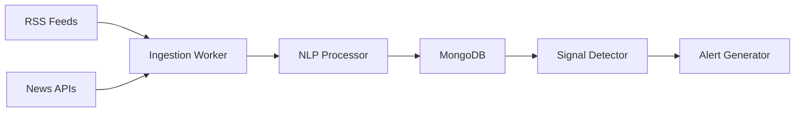

# 📰 Feature Spec: News Ingestion Pipeline

> **Priority**: P1 (High)  
> **Estimated Effort**: 1-2 weeks  
> **Dependencies**: None (standalone service)

---

## Overview

Automatically ingest health news from multiple sources to detect early outbreak signals, extract disease/location mentions, and score relevance.

---

## Data Sources

| Source | Type | Cost |
|--------|------|------|
| WHO Disease Outbreak News | RSS | Free |
| CDC Health Alert Network | RSS | Free |
| ProMED-mail | RSS | Free |
| NewsAPI.org | API | Free tier: 100 req/day |
| Google News Health | RSS | Free |

---

## Architecture



---

## API Endpoints

### GET /news/articles
List ingested articles with filters.

**Query Params**: `disease`, `location`, `source`, `from_date`, `limit`

**Response**:
```json
{
  "articles": [
    {
      "id": "art_123",
      "title": "Dengue cases surge in Mumbai",
      "source": "Times of India",
      "url": "https://...",
      "published_at": "2024-01-15T10:00:00Z",
      "diseases": ["dengue"],
      "locations": ["Mumbai", "Maharashtra"],
      "relevance_score": 0.92
    }
  ],
  "count": 25
}
```

### POST /news/ingest
Trigger manual ingestion (admin).

### GET /news/signals
Get extracted health signals.

---

## Database Schema

```javascript
// news_articles
{
  "_id": ObjectId,
  "url": "https://...",
  "url_hash": "sha256_hash",  // For dedup
  "title": "Dengue outbreak...",
  "source": "TOI",
  "source_type": "rss",  // "rss" | "api"
  "published_at": ISODate,
  "ingested_at": ISODate,
  "content": "Full article text...",
  "language": "en",
  "diseases": ["dengue"],
  "locations": ["Mumbai"],
  "relevance_score": 0.92,
  "processed": true
}

// health_signals
{
  "_id": ObjectId,
  "article_id": ObjectId,
  "disease": "dengue",
  "location": "Mumbai",
  "signal_type": "outbreak_mention",
  "confidence": 0.85,
  "extracted_at": ISODate
}
```

---

## NLP Processing

Use **spaCy** for Named Entity Recognition:

```python
import spacy

nlp = spacy.load("en_core_web_sm")

DISEASE_KEYWORDS = ["dengue", "covid", "malaria", "cholera", ...]

def extract_entities(text: str):
    doc = nlp(text)
    locations = [ent.text for ent in doc.ents if ent.label_ == "GPE"]
    diseases = [w for w in DISEASE_KEYWORDS if w.lower() in text.lower()]
    return {"locations": locations, "diseases": diseases}
```

---

## Background Jobs

Use **APScheduler** or **Celery**:

```python
# Ingest every 30 minutes
@scheduler.scheduled_job('interval', minutes=30)
async def ingest_news():
    await ingest_rss_feeds()
    await ingest_news_api()
    await process_unprocessed_articles()
```

---

## File Structure

```
backend/
├── services/
│   ├── news/
│   │   ├── __init__.py
│   │   ├── ingestion.py    # RSS/API fetching
│   │   ├── processor.py    # NLP extraction
│   │   ├── signals.py      # Signal detection
│   │   └── sources.py      # Source configurations
├── routes/
│   └── news.py
└── schemas/
    └── news.py
```

---

## Configuration

Add to `.env`:
```
NEWS_API_KEY=your_newsapi_key
NEWS_INGEST_INTERVAL_MINUTES=30
NEWS_RELEVANCE_THRESHOLD=0.5
```

---

## Dependencies

Add to `requirements.txt`:
```
spacy>=3.7.0
feedparser>=6.0.0
httpx>=0.27.0
apscheduler>=3.10.0
```

Download spaCy model:
```bash
python -m spacy download en_core_web_sm
```

---

## Acceptance Criteria

- [ ] RSS feeds ingest on schedule
- [ ] Articles deduplicated by URL hash
- [ ] Diseases/locations extracted
- [ ] Relevance score computed
- [ ] API returns filtered articles
- [ ] Signals linked to articles
