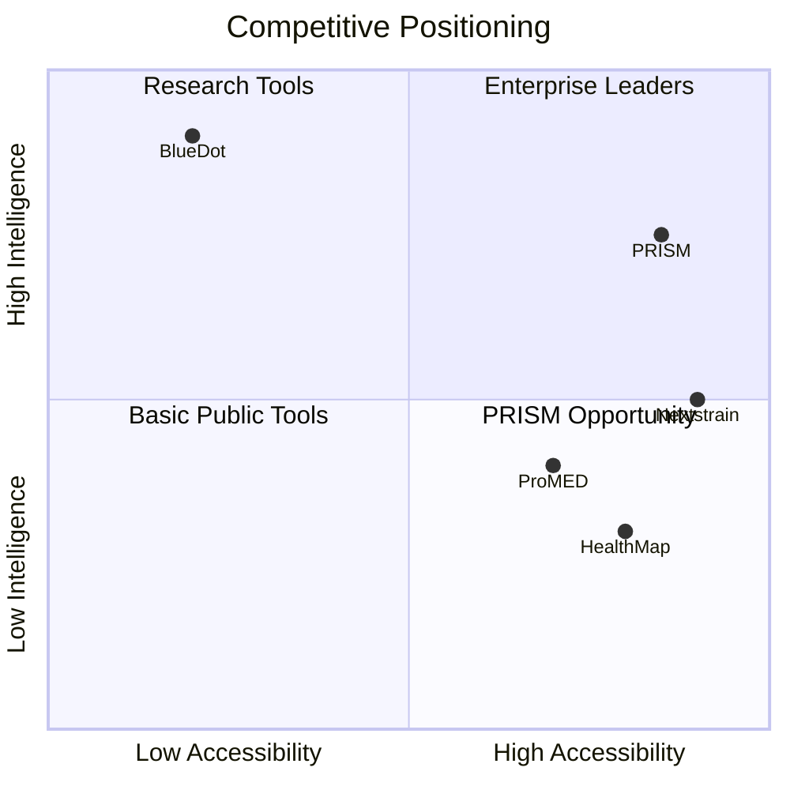
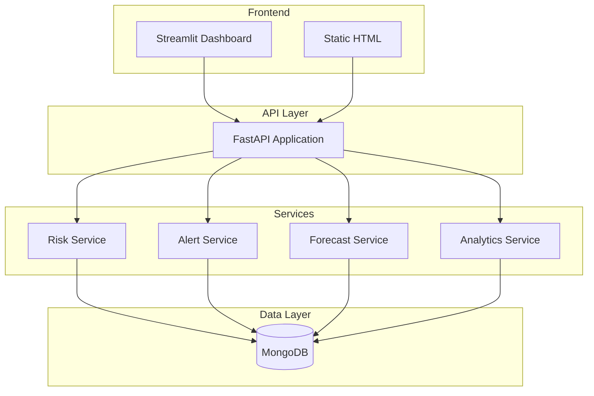
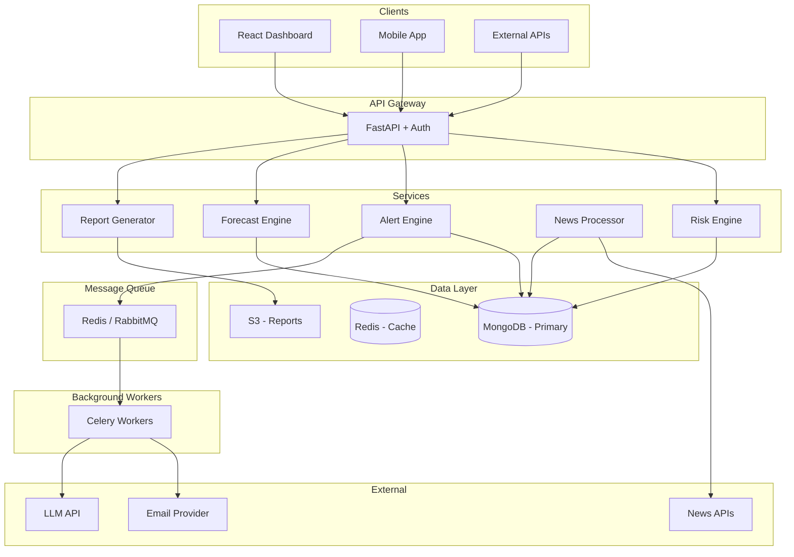

# 🔬 PRISM Master Blueprint
## Predictive Risk Intelligence & Surveillance Model

> **Purpose**: This document serves as the comprehensive context and strategic guide for AI agents building PRISM. It captures the vision, architecture, competitive positioning, and implementation roadmap.

---

# Part 1: Vision & Strategic Context

## 1.1 What is PRISM?

**PRISM (Predictive Risk Intelligence & Surveillance Model)** is an open-source, self-hostable disease surveillance and outbreak prediction platform. It provides real-time risk assessment, automated alerting, and predictive forecasting for infectious disease outbreaks.

### Core Value Proposition
> **"BlueDot for the rest of us"** — An affordable, open-source alternative to enterprise epidemic intelligence platforms, designed for public health departments, NGOs, researchers, and healthcare organizations that cannot afford $100K+ enterprise solutions.

### Mission Statement
Democratize access to AI-powered disease surveillance and outbreak prediction, enabling any organization to protect their communities with the same intelligence capabilities previously available only to well-funded enterprises.

---

## 1.2 Dual-Product Strategy

We are building two distinct products on a shared intelligence core:

### 🅰️ Product A: PRISM Command (Priority)
**"The Air Traffic Control for Disease Outbreaks"**
- **User**: Health Officers, Hospital Admins, Government Agencies.
- **Core Value**: Predictive Resource Allocation.
- **Key Question**: "Where do I send beds/oxygen *before* the crisis?"
- **Metric**: Response Time Reduction.

### 🅱️ Product B: PRISM Public (Future)
**"The Weather App for Health"**
- **User**: Everyday Citizens.
- **Core Value**: Personal Risk Awareness & Actionable Advice.
- **Key Question**: "Is it safe for me to go out today?"
- **Metric**: Daily Active Users (DAU).

> **Current Focus**: strictly **Product A (Command)** to solve the critical "mismanagement" problem first.

---

## 1.2 Target Users

| User Segment | Pain Points | PRISM Solution |
|--------------|-------------|----------------|
| **Local/State Health Departments** | Limited budgets, no predictive tools | Self-hosted, free, easy deployment |
| **NGOs & Global Health Orgs** | Need multi-disease, multi-region tracking | Flexible disease configuration, extensible |
| **Researchers & Epidemiologists** | Need API access to outbreak data | RESTful API, data export, reproducibility |
| **Hospital Networks** | Need early warning for surge planning | Alerts, forecasting, risk scores |
| **Developing Country Ministries** | No access to enterprise tools | Open-source, low infrastructure requirements |

---

## 1.3 Competitive Landscape

### Major Players

| Platform | Type | Strengths | Weaknesses |
|----------|------|-----------|------------|
| **BlueDot** | Enterprise SaaS | AI-powered, 65 languages, airline data, detected COVID 9 days early | Very expensive, enterprise-only, closed |
| **HealthMap** | Public Platform | Free, real-time map, news aggregation | Limited analytics, no prediction |
| **ProMED-mail** | Alert Network | Expert curation, early signals | No visualization, email-based |
| **Nextstrain** | Genomic | Beautiful visualizations, open-source | Genomic-only, no epidemiology |
| **EpiPulse (ECDC)** | Government | Official European data, forecasting | Europe-only, government access |
| **MRIIDS** | Research | International spread prediction | Research-focused, not productized |

### PRISM's Competitive Position



### Differentiation Strategy

PRISM wins by being:
1. **Open-Source** — Full transparency, community-driven
2. **Self-Hostable** — No vendor lock-in, data sovereignty
3. **API-First** — Integrate with any system
4. **Affordable** — Free core, optional paid support
5. **Modern Stack** — FastAPI, MongoDB, Python ML ecosystem

---

# Part 2: Current State Analysis

## 2.1 What's Already Built

**Location**: `C:\0001_Project\PRISM`

### Architecture Overview

```
PRISM/
├── backend/
│   ├── app.py              # FastAPI application
│   ├── config.py           # Environment configuration
│   ├── db.py               # MongoDB connection
│   ├── exceptions.py       # Custom domain exceptions ✅
│   ├── logging_config.py   # Centralized logging
│   ├── routes/
│   │   ├── health.py       # Health checks
│   │   ├── risk.py         # Risk scoring
│   │   ├── alerts.py       # Alert generation
│   │   ├── forecasts.py    # ARIMA forecasting
│   │   ├── hotspots.py     # Hotspot detection
│   │   ├── diseases.py     # Multi-disease management
│   │   ├── pipeline.py     # Full pipeline orchestration
│   │   ├── evaluation.py   # Model evaluation
│   │   └── regions.py      # Region management
│   ├── services/
│   │   ├── risk.py         # Risk calculation with climate boost
│   │   ├── arima_forecasting.py  # Time series forecasting
│   │   ├── alerts.py       # Alert logic
│   │   ├── analytics.py    # Analytics service
│   │   └── notifications.py # Notification service
│   ├── schemas/
│   │   ├── responses.py    # Pydantic response models ✅
│   │   ├── disease.py      # Disease schemas
│   │   └── ...
│   └── dashboard/          # Streamlit UI
├── frontend/
│   └── index.html          # Static frontend
├── tests/
│   ├── unit/               # Unit tests ✅
│   └── integration/        # API integration tests ✅
└── docs/                   # Documentation
```

### Features Status

| Feature | Status | Notes |
|---------|--------|-------|
| FastAPI REST API | ✅ Complete | Full CRUD operations |
| MongoDB Integration | ✅ Complete | Connection pooling, indexes |
| Risk Scoring | ✅ Complete | With climate boost |
| Alert Generation | ✅ Complete | Threshold-based |
| ARIMA Forecasting | ✅ Complete | 7-day horizon |
| Multi-Disease Support | ✅ Complete | Configurable |
| Streamlit Dashboard | ✅ Complete | Basic visualizations |
| Custom Exceptions | ✅ Complete | Domain-specific |
| Pydantic Models | ✅ Complete | API responses |
| Unit Tests | ✅ Complete | Exceptions, validators |
| Integration Tests | ✅ Complete | API endpoints |
| Interactive Heatmap | ❌ Missing | Priority feature |
| News Ingestion | ❌ Missing | Future enhancement |
| SMS/Email Alerts | ❌ Missing | Notification channels |
| Modern Web Dashboard | ❌ Missing | React/Vue replacement |

---

## 2.2 Technical Stack

| Layer | Technology | Version |
|-------|------------|---------|
| **API Framework** | FastAPI | 0.110.0+ |
| **Database** | MongoDB | 4.4+ |
| **Forecasting** | statsmodels (ARIMA) | Latest |
| **Dashboard** | Streamlit | Latest |
| **Validation** | Pydantic | v2 |
| **Testing** | pytest | Latest |
| **Python** | Python | 3.9+ |

---

# Part 3: Feature Roadmap

## 3.1 Priority Matrix: Focus on PRISM Command

```mermaid
graph TB
    subgraph "P0 - Product A Core (Command Center)"
        A[Resource Allocation Intelligence]
        B[Admin Dashboard (Command View)]
        C[Simulation Engine (Realistic Data)]
    end
    
    subgraph "P1 - Intelligence Layer"
        D[Interactive Risk Heatmap]
        E[Enhanced Forecasting (Cases -> Beds)]
        F[Automated Alerts (Staffing Triggers)]
    end
    
    subgraph "P2 - Product B (Public Layer)"
        G[Public Mobile View]
        H[Personal Risk Score]
        I[AQI / Environmental Integration]
    end
    
    A --> D
    B --> E
    C --> F
    D --> G
    E --> H
```

---

## 3.2 Detailed Feature Specifications

### P0: Interactive Risk Heatmap

**Goal**: Replace basic Streamlit visualizations with an interactive geographic heatmap showing real-time risk levels.

**Requirements**:
- Leaflet.js or Mapbox GL integration
- Color-coded regions by risk level (green/yellow/orange/red)
- Click-to-select regions for detailed stats
- Time slider for historical data
- Legend and scale indicators
- Responsive design

**Technical Approach**:
```
Option A: Standalone HTML/JS page served by FastAPI
Option B: React component consuming /risk/latest API
Option C: Streamlit with folium/pydeck integration
```

**API Endpoints Needed**:
- `GET /risk/geojson` — Return risk scores as GeoJSON
- `GET /regions/boundaries` — Return region polygons

---

### P0: Email Alert Notifications

**Goal**: Send automated email alerts when risk thresholds are exceeded.

**Requirements**:
- SMTP configuration (SendGrid, SES, or custom)
- HTML email templates with risk summary
- Subscriber management
- Opt-in/opt-out support
- Digest mode (hourly/daily summary)

**Technical Approach**:
- Use `fastapi-mail` or `aiosmtplib`
- Store subscribers in MongoDB
- Background task with Celery or FastAPI BackgroundTasks

**New Endpoints**:
- `POST /notifications/subscribe`
- `DELETE /notifications/unsubscribe`
- `GET /notifications/preferences`

---

### P0: PDF Report Generation

**Goal**: Generate downloadable outbreak reports.

**Requirements**:
- Weekly summary reports
- Region-specific reports
- Include charts, tables, risk scores
- Downloadable PDF format
- Scheduled generation

**Technical Approach**:
- Use `weasyprint` or `reportlab`
- Jinja2 templates for HTML → PDF
- Store generated reports in filesystem/S3

**New Endpoints**:
- `POST /reports/generate`
- `GET /reports/{report_id}`
- `GET /reports/list`

---

### P1: Modern React Dashboard

**Goal**: Replace Streamlit with a production-grade React dashboard.

**Requirements**:
- Responsive, mobile-friendly
- Dark/light mode
- Real-time updates (WebSocket)
- Authentication (optional)
- Charts: Recharts or Chart.js
- Maps: Leaflet or Mapbox

**Page Structure**:
```
/                   → Dashboard overview
/risk               → Risk heatmap & scores
/alerts             → Alert management
/forecasts          → Forecast charts
/regions/{id}       → Region detail view
/settings           → Configuration
```

---

### P1: News Ingestion Pipeline

**Goal**: Automatically ingest health news to detect outbreak signals.

**Requirements**:
- RSS feed aggregation
- News API integration (NewsAPI, GDELT)
- NLP extraction (disease mentions, locations)
- Relevance scoring
- Deduplication

**Technical Approach**:
- Scheduled background jobs
- spaCy for NER (Named Entity Recognition)
- Store articles in MongoDB

**New Collections**:
- `news_articles` — Raw ingested articles
- `extracted_signals` — Processed health signals

---

### P1: Enhanced Forecasting Models

**Goal**: Improve prediction accuracy beyond ARIMA.

**Models to Add**:
1. **Prophet** — Facebook's time series forecasting
2. **LSTM** — Deep learning for sequences
3. **XGBoost** — Gradient boosting with features
4. **Ensemble** — Weighted combination

**Technical Approach**:
- Model registry pattern
- A/B testing framework
- Model performance tracking

---

### P2: LLM-Powered Insights

**Goal**: Natural language summaries and Q&A.

**Features**:
- "What's happening with dengue this week?" → NL summary
- Automated alert narratives
- Trend explanations
- Anomaly descriptions

**Technical Approach**:
- OpenAI API or local LLM (Ollama)
- RAG (Retrieval Augmented Generation) for context
- Prompt templates for different insight types

---

# Part 4: Technical Architecture

## 4.1 Current Architecture



## 4.2 Target Architecture



---

## 4.3 Database Schema

### Current Collections

```javascript
// regions
{
  "_id": ObjectId,
  "region_id": "IN-MH",
  "region_name": "Maharashtra",
  "country": "India",
  "geometry": GeoJSON  // Future: for heatmap
}

// cases_daily
{
  "_id": ObjectId,
  "region_id": "IN-MH",
  "date": ISODate,
  "disease": "dengue",
  "confirmed": 150,
  "deaths": 2,
  "recovered": 100
}

// risk_scores
{
  "_id": ObjectId,
  "region_id": "IN-MH",
  "date": ISODate,
  "disease": "dengue",
  "risk_score": 0.75,
  "risk_level": "HIGH",
  "drivers": ["increasing_cases", "monsoon_season"],
  "climate_info": { ... }
}

// alerts
{
  "_id": ObjectId,
  "region_id": "IN-MH",
  "date": ISODate,
  "disease": "dengue",
  "risk_score": 0.75,
  "risk_level": "HIGH",
  "reason": "Risk score exceeded threshold",
  "created_at": ISODate,
  "notified": false
}

// forecasts_daily
{
  "_id": ObjectId,
  "region_id": "IN-MH",
  "date": ISODate,
  "disease": "dengue",
  "pred_mean": 165.5,
  "pred_lower": 140.0,
  "pred_upper": 190.0,
  "model_version": "arima_v1",
  "generated_at": ISODate
}
```

### New Collections (Planned)

```javascript
// subscribers (for notifications)
{
  "_id": ObjectId,
  "email": "user@example.com",
  "regions": ["IN-MH", "IN-KA"],
  "diseases": ["dengue", "covid"],
  "frequency": "daily",
  "active": true,
  "created_at": ISODate
}

// news_articles
{
  "_id": ObjectId,
  "url": "https://...",
  "title": "Dengue outbreak in Mumbai",
  "source": "Times of India",
  "published_at": ISODate,
  "ingested_at": ISODate,
  "content": "...",
  "extracted_diseases": ["dengue"],
  "extracted_locations": ["Mumbai"],
  "relevance_score": 0.85
}

// reports
{
  "_id": ObjectId,
  "type": "weekly_summary",
  "region_id": "IN-MH",
  "disease": "dengue",
  "period_start": ISODate,
  "period_end": ISODate,
  "file_path": "/reports/2024/week-3-maharashtra.pdf",
  "generated_at": ISODate
}
```

---

# Part 5: Implementation Guidelines

## 5.1 Code Organization Principles

1. **Service Layer Pattern**: All business logic in `services/`, routes are thin
2. **Repository Pattern**: Database operations isolated in `db.py` or dedicated repos
3. **Dependency Injection**: Use FastAPI's `Depends()` for testability
4. **Custom Exceptions**: Use `backend/exceptions.py` for domain errors
5. **Pydantic Models**: All API responses use schemas from `backend/schemas/`

## 5.2 API Design Standards

- **Versioning**: Prefix with `/api/v1/` (future)
- **Naming**: Plural nouns for resources (`/alerts`, not `/alert`)
- **Query Params**: Use for filtering (`?disease=dengue&region_id=IN-MH`)
- **Pagination**: Use `limit` and `offset` or cursor-based
- **Errors**: Return structured `ErrorResponse` with appropriate HTTP codes

## 5.3 Testing Strategy

```
tests/
├── unit/                 # Pure function tests, no DB
│   ├── test_exceptions.py
│   ├── test_validators.py
│   └── test_services.py
├── integration/          # API tests with test DB
│   ├── test_health_api.py
│   ├── test_risk_api.py
│   └── ...
└── e2e/                  # End-to-end browser tests (future)
    └── test_dashboard.py
```

**Run Tests**:
```bash
# All tests
pytest

# Unit only
pytest tests/unit/

# With coverage
pytest --cov=backend --cov-report=html
```

## 5.4 Configuration Management

- **Environment Variables**: All config via `.env`
- **Defaults**: Sensible defaults in `backend/config.py`
- **Secrets**: Never commit secrets, use `.env.example` as template
- **Validation**: Pydantic Settings for type-safe config

---

# Part 6: Development Workflow

## 6.1 Getting Started

```bash
# 1. Clone and setup
cd C:\0001_Project\PRISM
python -m venv .venv
.venv\Scripts\activate
pip install -r requirements.txt

# 2. Configure
cp .env.example .env
# Edit .env with your MongoDB URI

# 3. Start services
python start_prism.py

# 4. Verify
# API: http://localhost:8000/docs
# Dashboard: http://localhost:8501
```

## 6.2 Development Loop

1. **Pick a task** from the roadmap
2. **Create branch**: `feature/interactive-heatmap`
3. **Write tests first** (TDD encouraged)
4. **Implement feature**
5. **Run tests**: `pytest`
6. **Update docs** if needed
7. **Create PR** with description

## 6.3 Key Commands

```bash
# Start API only
python -m uvicorn backend.app:app --reload

# Start dashboard only
python run_dashboard.py

# Run full pipeline
python run_pipeline.py --disease dengue --date 2024-01-15

# Seed sample data
python -m backend.scripts.seed

# Load CSV data
python -m backend.scripts.load_csv Datasets/your_data.csv
```

---

# Part 7: Context for AI Agents

## 7.1 When Working on PRISM

**Always remember**:
1. PRISM is at `C:\0001_Project\PRISM`
2. It's a FastAPI + MongoDB + Streamlit stack
3. Custom exceptions are in `backend/exceptions.py`
4. Response models are in `backend/schemas/responses.py`
5. Tests exist in `tests/unit/` and `tests/integration/`
6. Run `pytest` after any code changes

## 7.2 Key Files to Reference

| Purpose | File Path |
|---------|-----------|
| Main app | `backend/app.py` |
| Configuration | `backend/config.py` |
| Database | `backend/db.py` |
| Exceptions | `backend/exceptions.py` |
| Response schemas | `backend/schemas/responses.py` |
| Risk service | `backend/services/risk.py` |
| Forecast service | `backend/services/arima_forecasting.py` |
| Test fixtures | `tests/conftest.py` |

## 7.3 Common Tasks

### Adding a New Endpoint

1. Create route in `backend/routes/your_route.py`
2. Register in `backend/app.py`
3. Add response model in `backend/schemas/responses.py`
4. Add tests in `tests/integration/test_your_api.py`

### Adding a New Service

1. Create service in `backend/services/your_service.py`
2. Inject via FastAPI `Depends()`
3. Add unit tests in `tests/unit/test_your_service.py`

### Handling Errors

```python
from backend.exceptions import ValidationError, DataNotFoundError

# In route handlers
if not valid_date(date):
    raise DateValidationError(date)

if not data:
    raise DataNotFoundError("RiskScore", identifier=region_id)
```

---

# Part 8: Next Steps

## Immediate Actions (This Session)

1. [ ] Review and approve this blueprint
2. [ ] Prioritize P0 features to implement first
3. [ ] Set up playground for prototyping

## Short-term (Next 2 Weeks)

1. [ ] Implement interactive risk heatmap
2. [ ] Add email notification system
3. [ ] Create PDF report generator

## Medium-term (1-2 Months)

1. [ ] Build React dashboard
2. [ ] Implement news ingestion pipeline
3. [ ] Add Prophet/LSTM forecasting

---

*Last Updated: 2026-01-21*
*Author: AI Agent (Antigravity)*
*Project: PRISM v1.0*
